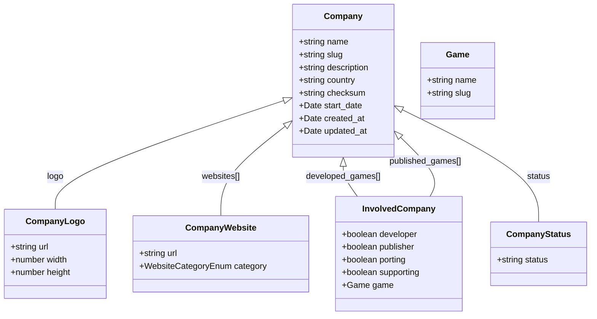

# Company Type Relationships

This diagram shows the relationships between the `Company` type and other types in the IGDB API.

## Company Entity Relationships

## Notes on Company Relationships

- **Company Logo**: Visual identity of the company
- **Company Websites**: Official websites, social media, and other web resources for the company
- **Involved Company**: Represents the relationship between a company and a game, including the role the company played in the game's development or publication
- **Company Status**: The current operational status of the company (e.g., active, closed)

## Company Roles in Game Development

The `InvolvedCompany` type represents the relationship between a company and a game, with boolean flags indicating the company's role:

- **developer**: The company developed the game
- **publisher**: The company published the game
- **porting**: The company ported the game to different platforms
- **supporting**: The company provided support for the game's development

A company can have multiple roles for a single game, and a game can have multiple companies involved in different capacities.