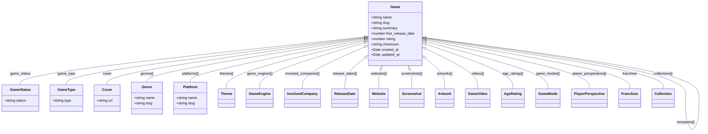

# Game Type Relationships

This diagram shows the relationships between the `Game` type and other major types in the IGDB API.

## Core Game Entity Relationships



## Notes on Relationship Types

- **One-to-One**: Relationships like `game_status`, `game_type`, and `cover` are one-to-one relationships where a game has at most one of these entities.
- **One-to-Many**: Relationships like `genres`, `platforms`, and `themes` are one-to-many relationships where a game can have multiple of these entities.
- **Self-Referential**: Relationships like `parent_game`, `similar_games`, and `dlcs` are self-referential relationships where a game references other games.

## Expansion Pattern

In the IGDB API, relationships can be represented in two ways:

1. **ID References**: Properties contain numeric IDs that reference other entities
2. **Expanded Objects**: Properties contain the full objects of the related entities

This is represented in the type definitions using union types, for example:

```
// Example of a relationship property in the Game type
genres?: number[] | Genre[];
```

This means the `genres` property can be either an array of genre IDs or an array of Genre objects, depending on whether the relationship was expanded in the API request.
