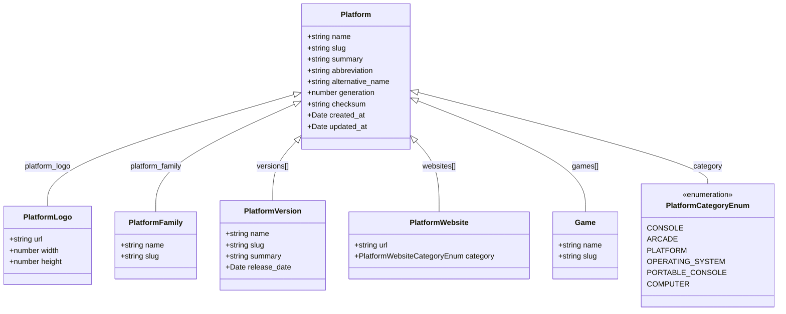

# Platform Type Relationships

This diagram shows the relationships between the `Platform` type and other types in the IGDB API.

## Platform Entity Relationships

## Notes on Platform Relationships

- **Platform Family**: Platforms can belong to a family (e.g., PlayStation, Xbox)
- **Platform Versions**: A platform can have multiple versions (e.g., PlayStation 4 Pro, PlayStation 4 Slim)
- **Platform Websites**: Official websites, social media, and other web resources for the platform
- **Games**: Games that are available on the platform

## Platform Categories

The `PlatformCategoryEnum` defines the type of platform:

- **CONSOLE**: Home video game consoles (e.g., PlayStation 4, Xbox One)
- **ARCADE**: Arcade machines
- **PLATFORM**: Gaming platforms that don't fit other categories
- **OPERATING_SYSTEM**: Computer operating systems (e.g., Windows, macOS)
- **PORTABLE_CONSOLE**: Handheld gaming devices (e.g., Nintendo Switch, PlayStation Vita)
- **COMPUTER**: Computer hardware platforms